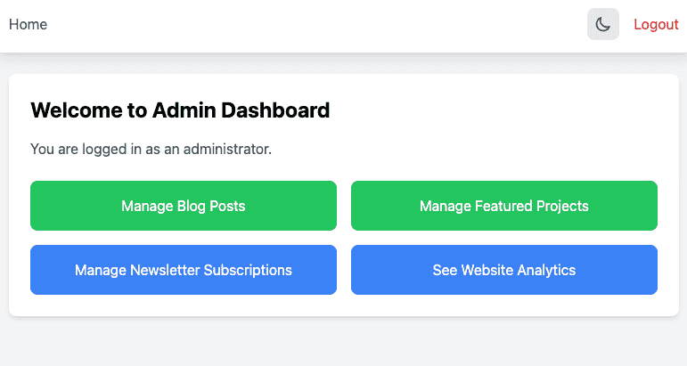
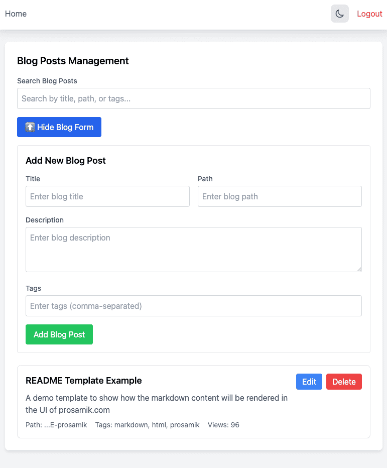
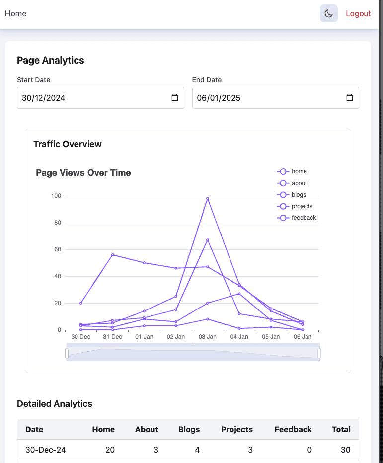
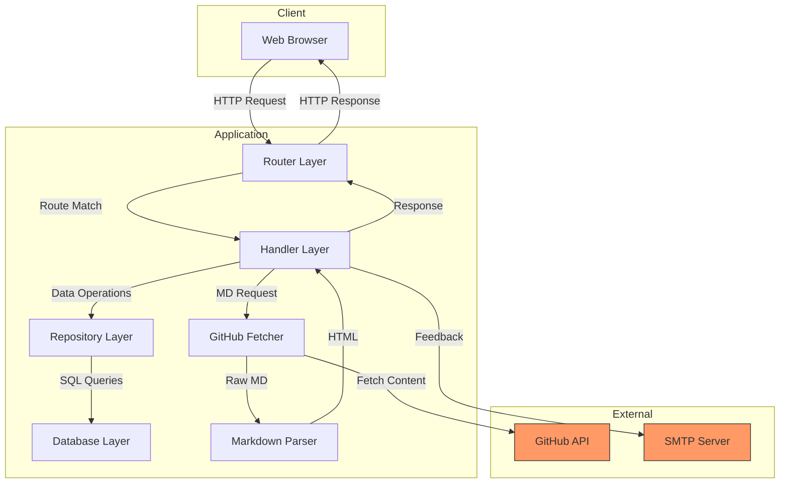
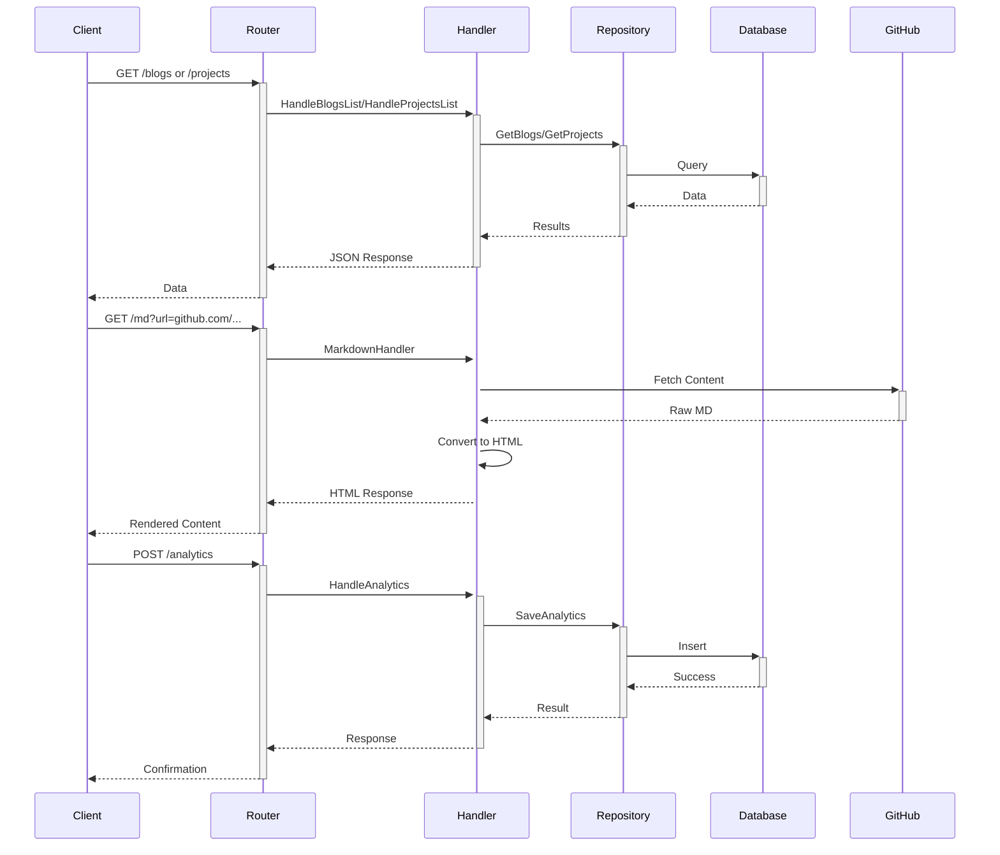

# ProSamik Golang Server

## Overview

This project began as a GitHub Markdown content fetcher and HTML converter but has evolved into a comprehensive dashboard application built with Go and HTMX. The application is compiled into a single binary and provides four main functionalities:

1. Markdown Content fetcher and Parser
2. Data Management for Blogs/Projects List 
3. Newsletter Email Management 
4. Website Analytics

### Dashboard Pages with dark theme support

#### Home


#### Post Management



#### Website analytics



## Architecture



### API Flow



### Core Components

1. **Router Layer** (`/internal/router/`)
   - Handles all incoming HTTP requests
   - Manages route definitions and middleware
   - Separates admin and public API routes

2. **Handler Layer** (`/internal/handler/`)
   - Processes incoming requests
   - Coordinates between different services
   - Manages business logic

3. **Repository Layer** (`/internal/repository/`)
   - Handles database operations
   - Provides data access abstraction
   - Manages CRUD operations

4. **Database Layer** (`/internal/database/`)
   - PostgreSQL database integration
   - Manages migrations
   - Handles connection pooling

5. **Authentication** (`/internal/auth/`)
   - JWT-based authentication
   - GitHub authentication integration

6. **Middleware** (`/internal/middleware/`)
   - Authentication middleware
   - Rate limiting
   - Request logging

### Public API Routes

The application exposes several public API endpoints that don't require authentication:

1. **GET /blogs**
   - Returns list of blog entries
   - Direct database query through repository
   - No pagination implemented yet

2. **GET /projects**
   - Returns list of project entries
   - Similar structure to blogs endpoint
   - Direct database query through repository

3. **GET /md**
   - Accepts URL parameter: `/md?url=https://github.com/username/repo`
   - Fetches markdown content from GitHub
   - Convert Markdown content to HTML content
   - Returns converted HTML

4. **POST /analytics**
   - Accepts page name in request body
   - Records analytics data
   - Only POST method allowed

5. **POST /feedback**
   - Accepts name, email and feedback message
   - Send it to the developer
   - Using SMTP server
   - Only POST method allowed and Rate limited

6. **POST /newsletter**
   - Accepts email address
   - Save it to the database
   - Only POST method allowed and Rate limited

### Dashboard Features

The dashboard (accessible after authentication) provides:

1. **Blog Management**
   - Add/Edit/Delete blog entries
   - Manage GitHub repository URLs
   - Additional metadata management

2. **Project Management**
   - Similar to blog management
   - Project-specific metadata

3. **Newsletter Management**
   - Subscriber management

4. **Analytics Dashboard**
   - View page visit statistics
   - Data visualization

## Data Flow

The application follows a clean architectural pattern where:

1. Router receives the request
2. Routes to the appropriate handler
3. Handler processes request and calls repository
4. Repository communicates with the database
5. Response flows back through the same layers

## Database Schema

The database structure is managed through migrations:

1. Newsletter Subscriptions (001)
2. Blogs (002)
3. Projects (003)
4. Analytics (004)

## Development Stack

- **Backend**: Go 1.22.0
- **Frontend**: HTMX
- **Database**: PostgreSQL
- **Authentication**: JWT
- **Container**: Docker
- **External APIs**: GitHub API
- **Email**: SMTP Integration

## Project Structure

The project follows a clean, modular structure with clear separation of concerns:

```
.
├── cmd/                  # Application entry points
├── internal/             # Private application code
│   ├── auth/             # Authentication logic
│   ├── database/         # Database and migrations
│   ├── fetcher/          # External content fetching
│   ├── handler/          # Request handlers
│   ├── middleware/       # HTTP middleware
│   ├── parser/           # Markdown parsing
│   ├── repository/       # Data access layer
│   ├── router/           # HTTP routing
│   └── templates/        # HTML templates
├── pkg/                  # Public library code
│   └── models/           # Data models
└── static/               # Static assets
```

## Future Improvements

1. Implement pagination for blogs and projects endpoints
2. Add rate limiting for GitHub requests
3. Enhance analytics visualization
4. Add verification of the email for newsletter
5. Add HTML template and campaign management

---